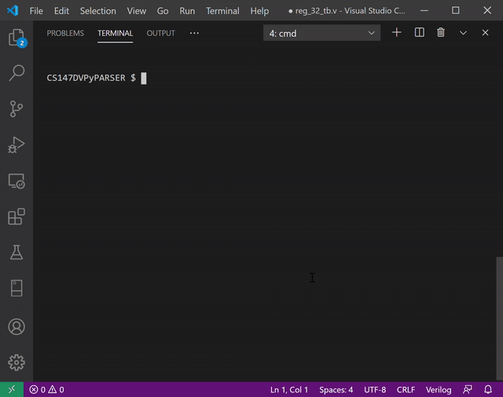

# CS147DVPyParser

This program was inspired by Jordan Conragan and written humbly by Rick DeAmicis in the fall semester of 2020 to quickly convert CS147DV instructions to hexadecimal. It may not work as intented if CS147DV has been changed/updated since it was last updated in December of 2019. Pull requests are encouraged.

## Requirements
The program is known to work with Python 3.7+. It should also work with Python2.7, but is untested.

Dependencies include the built-in packages `sys`, `os`, and `argparse`

## Quick set-up
The main function that does all the work is `AssemblyParser.parse_instructions()`. There are two main ways to interact with this method.
        
1. by importing it into your own script.
    ```python
    import AssemblyParser
    hex_result = AssemblyParser.parse_instruction('addi r2 r3 5')
    print(hex_result)
    ```
    the script's default setting is verbose. The call to `parse_instructions()` will send the following output to `stderr` by default
    ```
    I-Type
    <mnemonic> <rt> <rs> <imm> [base]
    input: addi r2 r3 5
     ___________________________________
    |opcode| rs  | rt  |   immediate    |
    |______|_____|_____|________________|

    opcode  rs      rt      imm
    001000  00011   00010   0000000000000101

    binary_string
    0010 0000 0110 0010 0000 0000 0000 0101
    ```
    the call to `print(hex_result)` in the above example will print:
    ```
    20620005
    ```
    To suppress the meta-information entirely, redirect that output from `sys.stderr` to 'devnull'. Do this by passing in the string 'devnull' as a second argument to `parse_instructions()`
    ```python
    hex_result = AssemblyParser.parse_instruction('addi r2 r3 5', 'devnull')
    print(hex_result)
    ```
    The above script will only print out the result to stdout:
        
        20620005
    

2. The script also works as a command line utility:
    
    to run it in basic interactive mode:
    
    
    
    ```python
    $ python AssemblyParser.py
    ```
    With no arguments, the script will enter interactive mode:
    ```
    WELCOME TO CS147DV INTERACTIVE INSTRUCTION PARSER!
    ENTER IN YOUR INSTRUCTIONS ONE AT A TIME
    THE RESULT WILL BE PRINTED TO THE SCREEN
    INPUT SHOULD BE OF THE TYPE:
      R-Type:  <mnemonic> <rd>,<rs>,<rt|shamt>
      I-Type:  <mnemonic> <rt>,<rs>, <imm>
      J-Type:  <mnemonic> <address>
    OUTPUT WILL BE A 32 BIT HEXADECIMAL NUMBER
    PRESS ctrl-c TO EXIT AT ANY TIME

    enter your intruction: _
    ```
    press `ctrl-c` at any time to exit.

    You can also parse a single instruction and exit immediately, without entering interactive mode.
    
    To do this, pass in the instruction to the script as a command line argument:
    ```
    $ python AssemblyParser.py "addi r2 r3 5"
    
    I-Type
    <mnemonic> <rt> <rs> <imm> [base]
    input: addi r2 r3 5
     ___________________________________
    |opcode| rs  | rt  |   immediate    |
    |______|_____|_____|________________|

    opcode  rs      rt      imm
    001000  00011   00010   0000000000000101

    binary_string
    0010 0000 0110 0010 0000 0000 0000 0101

    hexadecimal_string result:
    20620005
    
    $ _
    ```

    suppress meta-information with the `-q` flag. This can be used in any mode.

    interactive :
    ```
    $ python AssemblyParser.py -q

    enter in your instruction: addi r2 r3 5
    20620005


    enter in your instruction: _
    ```
    non-interactive :
    ```
    $ python AssemblyParser.py "addi r2 r3 5" -q
    20620005

    $ _
    ```


## CS147DV Instruction Format

Instructions must be of the form:
* R-Type
    * \<mnemonic> \<rd> \<rs> \<rt|shamt>
    * \<mnemonic> \<rd>, \<rs>, \<rt|shamt>
        
        ex: 
        * "add r2 r3 r4"
        * "add r2, r3, r4"
        * "add r2,r3,r4"
        
        Registers must begin with an `r` or and `R` and must be followed by a decimal. Thus `r10` will always map to binary 10d: `001010` and never binary 2d: `00010`

        If you choose an R-type instruction that requires a `shamt` instead of a register `rt`, the script will fail if the value passed in begins with an `[rR]`

        ex:
        * ```
          enter your intruction: sll r2 r3 r4
          shift operations require a shamt, not a register
          try again
          
          
          enter your intruction: sll r2 r3 4
          
          R-Type
          <mnemonic> <rd> <rs> <rt|shamt> [base]
          input: sll r2 r3 4
           _____________________________________
          |opcode| rs  | rt  | rd  |shamt| funct|
          |______|_____|_____|_____|_____|______|
          
          opcode  rs      rt      rd      shamt   funct
          000000  00011   00000   00010   000100  000001
          
          binary_string
          0000 0000 0110 0000 0001 0000 1000 0000 1
          
          hexadecimal_string result:
          00c02101
          ```

