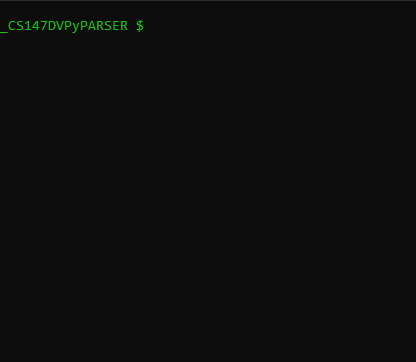

# CS147DVPyParser

This program was inspired by Jordan Conragan and written humbly by Rick DeAmicis in the fall semester of 2020 to quickly convert CS147DV instructions to hexadecimal. It may not work as intented if CS147DV has been changed/updated since it was last updated in December of 2019. Pull requests are encouraged.

## Requirements
The program is known to work with Python 3.7+. It should also work with Python2.7, but is untested.

Dependencies include the built-in packages `sys`, `os`, and `argparse`

## Quick set-up
The main function that does all the work is `AssemblyParser.parse_instructions()`. There are two main ways to interact with this method.
            
1. as a command line script:
    
    to run it in interactive mode:
    
    
    
    
    press `ctrl-c` at any time to exit.

    You can also parse a single instruction and exit immediately, without entering interactive mode:
    
    
        
    You are not limited to passing only a single instruction. Pass in as many as you want!
    
    
    
    You can pass in a whole file of instructions, one instructions per line in the file. The script will remove any comments starting with a `// ` or `# `
    
    
    
    1[](commentsRemoved.gif)
    
2. You can also import the module into your own script.
    ```python
    import AssemblyParser
    hex_result = AssemblyParser.parse_instruction('addi r2 r3 5')
    print(hex_result)
    ```
    the script's default setting is verbose. The call to `parse_instructions()` will send the following output to `stderr` by default
    ```
    I-Type
    <mnemonic> <rt> <rs> <imm> [base]
    input: addi r2 r3 5
     ___________________________________
    |opcode| rs  | rt  |   immediate    |
    |______|_____|_____|________________|

    opcode  rs      rt      imm
    001000  00011   00010   0000000000000101

    binary_string
    0010 0000 0110 0010 0000 0000 0000 0101
    ```
    the call to `print(hex_result)` in the above example will print:
    ```
    20620005
    ```
    To suppress the meta-information entirely, redirect that output from `sys.stderr` to 'devnull'. Do this by passing in the string 'devnull' as a second argument to `parse_instructions()`
    ```python
    hex_result = AssemblyParser.parse_instruction('addi r2 r3 5', 'devnull')
    print(hex_result)
    ```
    The above script will only print out the result to stdout:
        
        20620005


## CS147DV Instruction Format

Instructions must be of the form:
* R-Type
    * \<mnemonic> \<rd> \<rs> \<rt|shamt>
    * \<mnemonic> \<rd>, \<rs>, \<rt|shamt>
        
        ex: 
        * "add r2 r3 r4"
        * "add r2, r3, r4"
        * "add r2,r3,r4"
        
        Registers must begin with an `r` or and `R` and must be followed by a decimal. Thus `r10` will always map to binary 10d: `001010` and never binary 2d: `00010`

        If you choose an R-type instruction that requires a `shamt` instead of a register `rt`, the script will fail if the value passed in begins with an `[rR]`

        ex:
        * ```
          enter your intruction: sll r2 r3 r4
          shift operations require a shamt, not a register
          try again
          
          
          enter your intruction: sll r2 r3 4
          
          R-Type
          <mnemonic> <rd> <rs> <rt|shamt> [base]
          input: sll r2 r3 4
           _____________________________________
          |opcode| rs  | rt  | rd  |shamt| funct|
          |______|_____|_____|_____|_____|______|
          
          opcode  rs      rt      rd      shamt   funct
          000000  00011   00000   00010   000100  000001
          
          binary_string
          0000 0000 0110 0000 0001 0000 1000 0000 1
          
          hexadecimal_string result:
          00c02101
          ```
## Declaring your number data type
This script can handle binary, decimal, and hexadecimal values for the `<shamt>`, `<immediate>` and `<address>` values.  If the data type is not specified, the script will attempt to coerce the value into the appropriate type in the following order.  binary >> decimal >> hexadecimal.

This order is necessary because all binary strings that start with a 1 ex:`1010` are also valid decimal and hexadecimal strings. All decimals strings are also valid hexadecimal strings.  Thus it is best to expressly declare what data type you want. The options are `['bin, binary, decimal, decamal, hex, hexadecimal]`. Note the shortened versions `[b, d, dec]` are not allowed because they are all valid hexadecimal strings, which could lead to problems. The single character `h`, while not a valid binary, decimal, or hexadecimal string, is also not allowed for continuities sake.

Here is an example:


